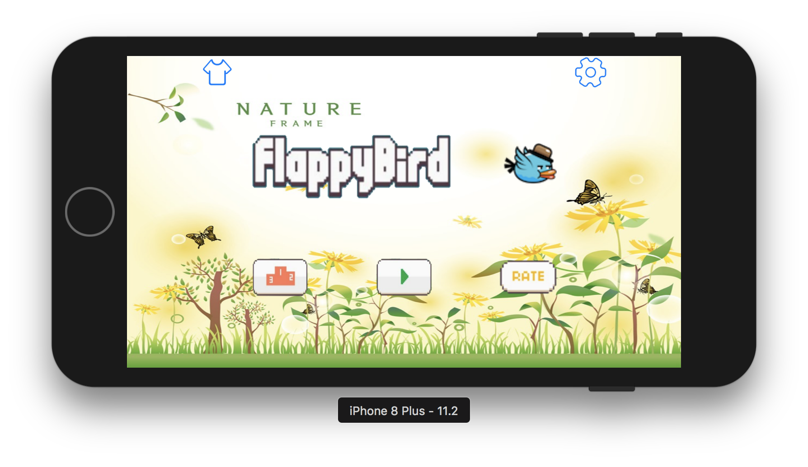
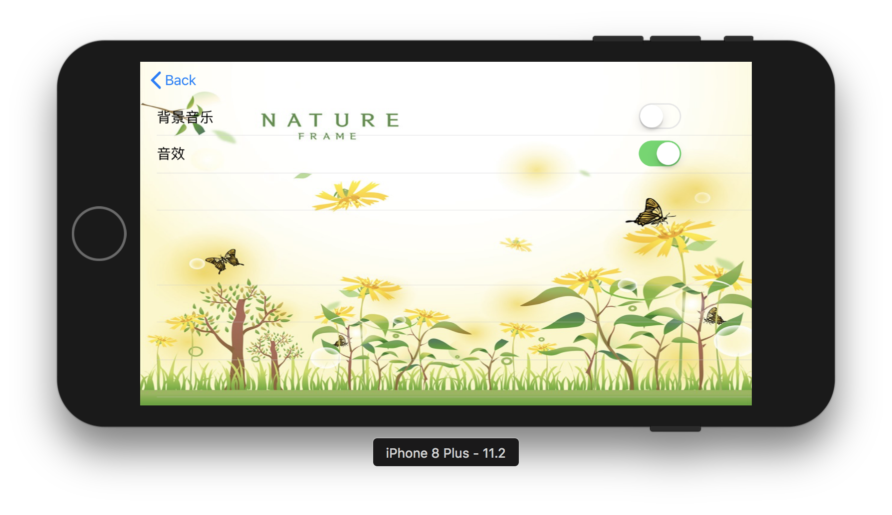
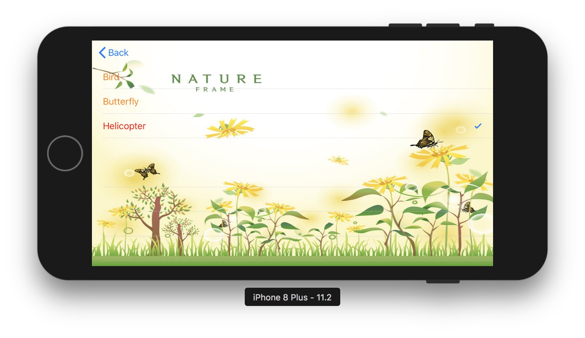
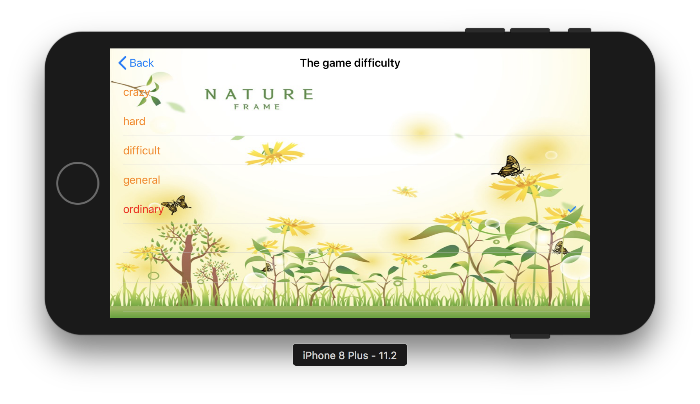
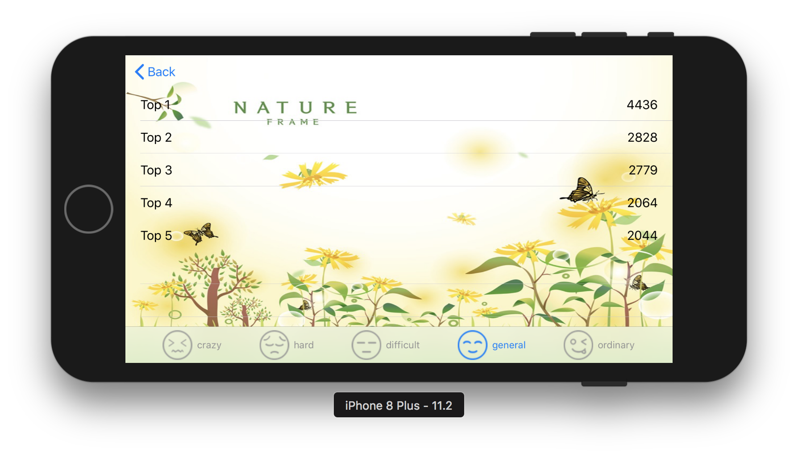
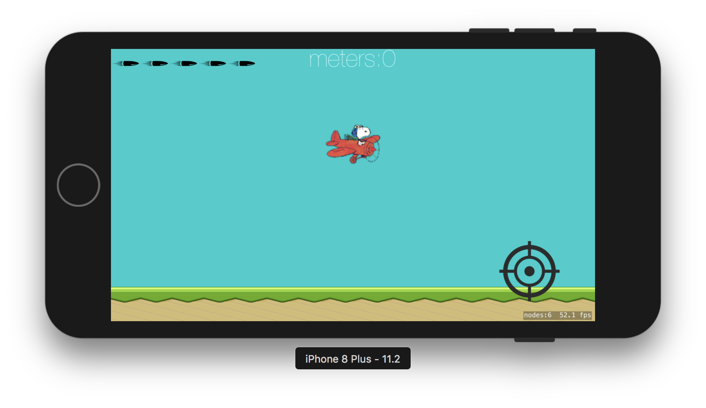
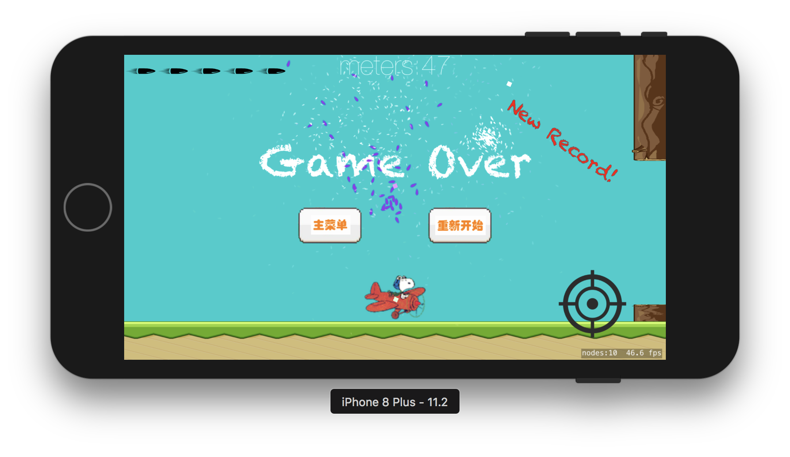

# FlappyBird
FlappyBird强化版

## 应用介绍
原本的的FlappyBird其实是一个非常简单的小游戏，我拓展了它的功能，增加了趣味度

### 菜单界面

### 系统设置

点击右上角系统设置图标

### 主题皮肤选择

目前设置了`Bird`、`Butterfly`、`Helicopter`三种主题，每种主题皮肤下拥有不同的**背景音乐**、**主角样式**、**水管样式**

初次启动游戏时默认是‘Helicopter’主题

## 主体功能
app主体分为**难度设置界面**、**排行榜界面**和**游戏主界面**

### 一、难度设置界面
目前设置了`crazy`、`hard`、`difficult`、`general`、`ordinary`五个难度梯度

不同难度下水管间的空隙不同

### 二、排行榜界面
每个难度下都有**Top1**、**Top2**、**Top3**、**Top4**、**Top5**

#### 三、游戏界面
游戏界面是本APP的核心

##### 游戏逻辑
* 点击屏幕开始游戏，小鸟受重力下落，每次点击屏幕给小鸟一个向上的力
* 左上角显示子弹剩余数量，初始为5发，游戏中可以通过“吃”礼物盒获得弹药补充，但子弹数量上限为5
* 点击右下角发射按钮发出子弹，子弹与水管碰撞后爆炸，子弹和水管都消失
* 小鸟撞击到水管或者落地，游戏结束
* 在每种难度下刷新**Top1**，即诞生新纪录时，会出现烟花庆祝和提示字

##### 音效设计
小鸟振翅声、通过水管空隙提示音、发射子弹音效、子弹和水管碰撞爆炸音效、吃到补给子弹音效、撞击死亡音效

音效可以设置开关

##### 动画特效设计
小鸟飞翔动画，子弹和水管爆炸动画，小鸟撞击死亡烟尘特效、新纪录礼花特效、GAMEOVER提示字登场动画

努力让移动端APP更精致、更有灵性

PS：目前游戏是纯色背景，因为图片背景下会导致FPS太低，影响游戏体验，日后优化一下，也许可以上图片背景
